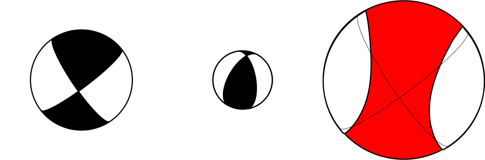

# Major and Minor double-couple decomposition of complex earthquake source
Major and Minor double-couple decomposition of complex moment tensor preserving dominant PT-axis
***************************************

This tool is intended for decomposition of non-double-couple seismic moment 
tensors (MTs) with preserved dominant P- or T-axis. The dominant axis direction 
is preserved for both the Major and Minor double-couple MTs. The Python script can 
be used for plotting of the trinity of beach-balls.

1 METHODOLOGY
===================

  Hallo, M., Asano, K., Gallovič, F. (2017). Bayesian inference and
interpretation of centroid moment tensors of the 2016 Kumamoto earthquake
sequence, Kyushu, Japan, Earth, Planets and Space, 69:134. [https://doi.org/10.1186/s40623-017-0721-4](https://doi.org/10.1186/s40623-017-0721-4)

  Hallo, M., Opršal, I., Asano, K., Gallovič, F. (2019). Seismotectonics
of the 2018 Northern Osaka M6.1 earthquake and its aftershocks: joint
movements on strike-slip and reverse faults in inland Japan, Earth,
Planets and Space, 71:34. [https://doi.org/10.1186/s40623-019-1016-8](https://doi.org/10.1186/s40623-019-1016-8)

2 TECHNICAL IMPLEMENTATION
===================

[](https://www.python.org/dev/peps/pep-0008/)

Matrix Methods, Cross-Platform (Windows, Linux, macOS), Portable Paths, Robust ASCII input parser, High-resolution image exports

The official software version is archived on Zenodo:

[](https://doi.org/10.5281/zenodo.19342063)

3 PACKAGE CONTENT
===================

  1. `maj_min_dc.m` - Decomposition of seismic moment tensors into Major and Minor sub-sources
  2. `example_mt.txt` - Example of text file with input moment tensors
  3. `plot_maj_min_dc.py` - Python code for plotting trinity of beach-balls
  4. `requirements.txt` - pip requirements file for instalation of dependencies

4 RELEASE HISTORY (MAJOR VERSIONS)
===================

*   **2.0 — Refactored Release** | April 2026
    *   Modernization: Fully ported to MATLAB R2025b with industry-standard directory structure
    *   UX/I-O: Robust ASCII parser, intuitive variable naming, and refined graphical reports

*   **1.3 — Initial Release** | March 2019
    *   Core implementation used by paper published in Earth, Planets and Space (Hallo et al., 2019)

5 REQUIREMENTS
===================

  MATLAB: Version R2025b, Codes do not require any additional Matlab Toolboxes
  
  Python: Version 3.12 or higher
  
  Libraries: matplotlib, numpy, obspy
  
  Install dependencies via pip:

```bash
pip install -r requirements.txt
```

6 USAGE
===================

  1. Prepare your `example_mt.txt` input file (Moment tensors in Harvard notation)
  2. Open MATLAB
  3. Run the main script: `maj_min_dc.m`
  4. Check the `/results` folder for high-resolution outputs
  5. Set and run the python tool: `python plot_maj_min_dc.py`
  6. Check for high-resolution outputs from python tool
  
7 EXAMPLE OUTPUT
===================

This tool extracts Major and Minor sub-sources from a complex seismic source.
The trinity of beach-balls shows two sub-sources with their sum (complex source mechanism).
Results are automatically plotted and saved.

<picture>
  <source media="(prefers-color-scheme: dark)" srcset="img/trinity_MT_dark.png">
  <source media="(prefers-color-scheme: light)" srcset="img/trinity_MT_light.png">
  
</picture>

```text
# Input deviatoric MT (Harvard):
 1.106667   1.536667  -2.643333   0.260000   0.080000  -0.720000
# Major DC MT (Harvard):
 0.219212   1.443353  -1.662566   0.583364  -0.035697  -0.521606
# Minor DC MT (Harvard):
 0.887454   0.093313  -0.980768  -0.323364   0.115697  -0.198394
# Input deviatoric MT (Strike/Dip/Rake):
146.20   74.12   13.77
 52.36   76.76  163.68
# Major DC (Strike/Dip/Rake):
 52.36   76.76  163.68
146.20   74.12   13.77
# Minor DC (Strike/Dip/Rake):
209.73   46.93  119.11
350.54   50.34   62.51
# Scalar seismic moment ratio of Major and Minor DC MTs:
0.63217  0.36783
```

8 COPYRIGHT
===================

Copyright (C) 2017,2018 Miroslav Hallo

This program is published under the GNU General Public License (GNU GPL).

This program is free software: you can modify it and/or redistribute it
or any derivative version under the terms of the GNU General Public
License as published by the Free Software Foundation, either version 3
of the License, or (at your option) any later version.

This code is distributed in the hope that it will be useful, but WITHOUT
ANY WARRANTY. We would like to kindly ask you to acknowledge the authors
and don't remove their names from the code.

You should have received copy of the GNU General Public License along
with this program. If not, see <http://www.gnu.org/licenses/>.
